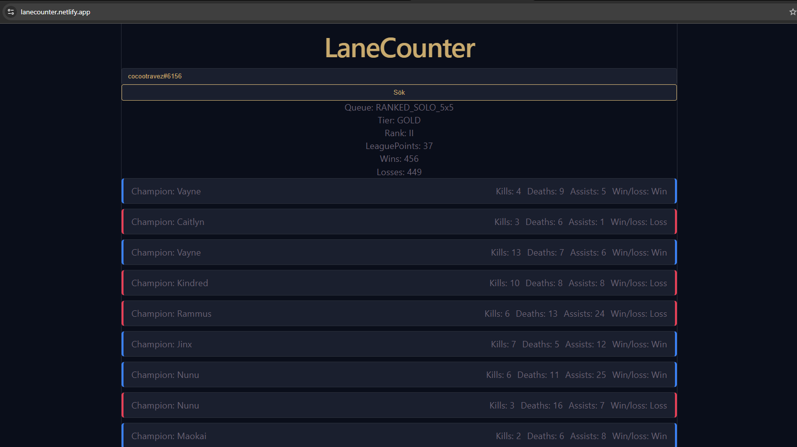

# LaneCounter

A full-stack web app for looking up League of Legends players — view match history and ranked statistics. Built to sharpen my .NET and React skills.



## Features
- Player lookup by summoner name
- Match history with game details
- Ranked stats and tier display

## Tech stack
- **Frontend:** React, TypeScript, Vite
- **Backend:** ASP.NET Core Web API, C#
- **External API:** Riot Games API

## Running locally
```bash
# Backend
cd server && dotnet run

# Frontend
cd client && npm install && npm run dev
```
